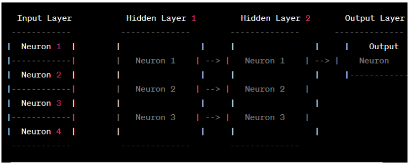

# Neural Networks Lab
- **[Code 1:](https://github.com/nishatrhythm/Neural-Networks/blob/main/code1.py)** - A simple neural network with one output neuron, four inputs and weights, and biase.
- **[Code 2:](https://github.com/nishatrhythm/Neural-Networks/blob/main/code2.py)** - Design the Code 1 of neural network by adjusting weights and biases randomly.
- **[Code 3:](https://github.com/nishatrhythm/Neural-Networks/blob/main/code3.py)** - A fully connected neural network — every neuron in the current layer has connections to every neuron from the previous layer.
- **[Code 4:](https://github.com/nishatrhythm/Neural-Networks/blob/main/code4.py)** - A fully connected neural network — every neuron in the current layer has connections to every neuron from the previous layer. You have 4 input neurons, one hidden layer consisting of 3 neurons and one output neuron. You should adust weights and biases randomly.
- **[Code 5:](https://github.com/nishatrhythm/Neural-Networks/blob/main/code5.py)** - Using loop option to get the weights, inputs and biases then feed into the neurons.
- **[Code 6:](https://github.com/nishatrhythm/Neural-Networks/blob/main/code6.py)** - Using numpy library to calculate dot product in the neural network.
- **[Code 7:](https://github.com/nishatrhythm/Neural-Networks/blob/main/code7.py)** - Using numpy library to calculate dot product in the neural network (Array).
- **[Code 8:](https://github.com/nishatrhythm/Neural-Networks/blob/main/code8.py)** - Take inputs containing 3 samples with 4 features, and 3 neurons with weights and biases, respectively. Then print the outputs of the neorons.
- **[Code 9:](https://github.com/nishatrhythm/Neural-Networks/blob/main/code9.py)** - Inputs-batch with weights and then transpose them to calculate dot product.
- **[Code 10:](https://github.com/nishatrhythm/Neural-Networks/blob/main/code10.py)** - Two hidden layers with four neurons at the first layer and three in the second.
- **[Code 11:](https://github.com/nishatrhythm/Neural-Networks/blob/main/code11.py)** - Two hidden layers with four neurons at the first layer and three in the second with randomized weights and biases.
- **[Code 12:](https://github.com/nishatrhythm/Neural-Networks/blob/main/code12.py)** - Sigmoidal activation function.
- **[Code 13:](https://github.com/nishatrhythm/Neural-Networks/blob/main/code13.py)** - The Rectified Linear Unit (ReLU) activation function.
- **[Code 14:](https://github.com/nishatrhythm/Neural-Networks/blob/main/code14.py)** - Step function.
- **[Code 15:](https://github.com/nishatrhythm/Neural-Networks/blob/main/code15.py)** - Solve AND gate problem using neural network.
- **[Code 16:](https://github.com/nishatrhythm/Neural-Networks/blob/main/code16.py)** - Design the Code 15 of neural network by adjusting weights and biases randomly.
- **[Code 17:](https://github.com/nishatrhythm/Neural-Networks/blob/main/code17.py)** - Solve OR gate problem using neural network.
- **Code 18** - Design a neural network that has four input neurons, two hidden layers, and one output layer neuron. The activation function in the output payer should be sigmoidal. You should also adjust the weights and biases randomly. Moreover, the input dataset should contain 10 samples. Follow the figure:<br><br>
- **[Code 19:](https://github.com/nishatrhythm/Neural-Networks/blob/main/code9.py)** - _[See below](https://github.com/nishatrhythm/Neural-Networks?tab=readme-ov-file#code-19)_
- **Code 20** -
- **Code 21** -
- **Code 22** -
- **Code 23** -

# Code 19
Create a dataset using pandas for the following attbituts and then predict the housing prices using neural network:
- Area: The total area of the house in square feet
- Bedrooms: The number of bedrooms in the house.
- Bathrooms: The number of bathrooms in the house.
- Age: The age of the house in years.
- Location: The neighborhood or area where the house is located.
- Garage Size: The size of the garage in square feet.
- Yard Size: The size of the yard or outdoor space in square feet.
- Amenities: A binary feature indicating whether the house has additional amenities such as a swimming pool, gym, etc.
- School Rating: The rating of nearby schools, on a scale from 1 to 10.
- Distance to City Center: The distance of the house from the city center in miles.
- Price: The selling price of the house.

## Dataset Example:
```
data = {
    'Area': [2000, 1800, 2500, 2200, 1900, 2800, 2100, 1700, 2400, 2000],
    'Bedrooms': [3, 2, 4, 3, 2, 5, 4, 2, 3, 3],
    'Bathrooms': [2, 1.5, 3, 2.5, 2, 3.5, 2.5, 1, 3, 2],
    'Age': [10, 5, 15, 8, 3, 20, 12, 6, 18, 9],
    'Location': ['Suburban', 'Urban', 'Rural', 'Suburban', 'Urban', 'Rural', 'Suburban', 'Urban', 'Rural', 'Suburban'],
    'Garage_Size': [400, 300, 500, 450, 350, 600, 400, 250, 550, 400],
    'Yard_Size': [800, 600, 1000, 900, 700, 1200, 800, 500, 1100, 800],
    'Amenities': [1, 0, 1, 1, 0, 1, 1, 0, 1, 1],
    'School_Rating': [8, 7, 6, 9, 8, 5, 7, 6, 4, 8],
    'Distance_to_City_Center': [5, 2, 10, 7, 4, 15, 6, 3, 12, 5],
    'Price': [300000, 250000, 350000, 320000, 280000, 400000, 310000, 240000, 370000, 300000]
}
