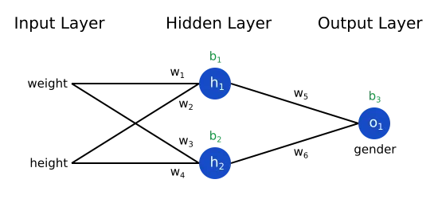
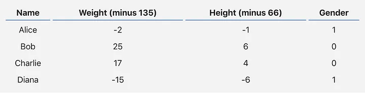
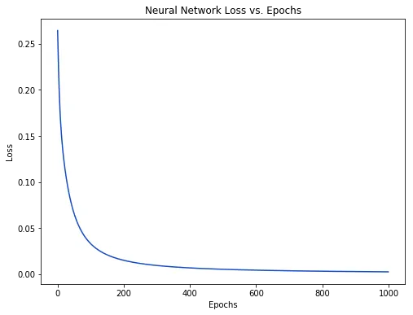

# Artificial Intelligence Lab
This repository features foundational AI projects, including both neural network implementations and Prolog programming for logic-based problem-solving. Key components of the repository include:

## Prolog Code
Examples for exploring logic programming, and AI principles using Prolog.
- The following examples are included in one file. _[[See the code here](https://github.com/nishatrhythm/Artificial-Intelligence-Lab/blob/main/prolog/8.%20experiment.pl)]_
    - Facts, rules, queries, and commands using `and`, `or`, and `not`.
    - Use of anonymous variables.
    - Arithmetic operations like factorial calculation, square of a number, and finding the nth Fibonacci number.
    - Implementation of if-else statements, comparison operators, and checks for positive, negative, or zero values.
    - Programs to check if a given year is a leap year.
    - Functions to find the maximum in a list and other useful algorithms.

- The following example is included in another file. _[[See the code here](https://github.com/nishatrhythm/Artificial-Intelligence-Lab/blob/main/prolog/9.%20family_tree.pl)]_
    - Family Tree Representation.

## Neural Network Implementations
- The following examples are included in one file. _[[See the code here](https://github.com/nishatrhythm/Artificial-Intelligence-Lab/blob/main/neural_network_basics.ipynb)]_
    - A simple neural network with one output neuron, four inputs and weights, and bias.
    - Design the previous example of neural network by adjusting weights and bias randomly.
    - A fully connected neural network — every neuron in the current layer has connections to every neuron from the previous layer.
    - A fully connected neural network — every neuron in the current layer has connections to every neuron from the previous layer. You have 4 input neurons, one hidden layer consisting of 3 neurons, and one output neuron. You should adjust weights and biases randomly.
    - Use a loop option to get the weights, inputs, and biases then fit into the neurons.
    - Use the numpy library to calculate the dot product in the neural network.
    - Use the numpy library to calculate the dot product in the neural network. (Array)
    - Previous example which multiplies the inputs with the transpose of the weights to demonstrate the concept of matrix row-column multiplication.
    - Take inputs containing 3 samples with 4 features and 3 neurons with weights and biases, respectively. Then print the outputs of the neurons.
    - Use an input batch with weights and then transpose them to calculate the dot product.
    - Two hidden layers with four neurons in the first layer and three in the second.
    - Two hidden layers with four neurons in the first layer and three in the second with randomized weights and biases.
    - Sigmoidal activation function.
    - tanh activation function.
    - Rectified Linear Unit (ReLU) activation function.
    - Leaky ReLU activation function.
    - Softmax activation function.
    - Linear (Identity) activation function.
    - Step function.
    - Design a neural network that has four input neurons, two hidden layers, and one output layer neuron. The activation function in the output layer should be sigmoidal. You should also adjust the weights and biases randomly. Moreover, the input dataset should contain 10 samples. Follow the figure:<br><br>

- The following examples are included in another file. _[[See the code here](https://github.com/nishatrhythm/Artificial-Intelligence-Lab/blob/main/neural_network_gates.ipynb)]_
    - Solve 2-input, and 3-input `AND`, `OR`, `NAND`, and `NOR` gate  using neural network.
    - Define the inputs and corresponding labels for the 2-input `AND`, `OR`, `NAND`, and `NOR` gate (random weights and biases).
    - Solve `NOT` gate using neural network.
    - Define the inputs and corresponding labels for the `NOT` gate (random weights and biases).
    - `AND`, `OR`, `NOT`, `NAND`, and `NOR` gate with the mean square error loss calculation.
    - Calculate loss function of the previous example and then minimize the error after Nth iterations by adjusting the parameters.
    - Modify the previous example in such a way that the neural network updates its parameters until the error or loss reaches to 5%.

- The following examples are included in another file. _[[See the code here](https://github.com/nishatrhythm/Artificial-Intelligence-Lab/blob/main/neural_network_gates_backpropagation.ipynb)]_
    - Solve `AND`, `OR`, `NAND`, and `NOR` gate using backpropagation.
    - Solve the `X-OR` gate using backpropagation.

- The following examples are included in another file. _[[See the code here](https://github.com/nishatrhythm/Artificial-Intelligence-Lab/blob/main/graph.ipynb)]_
    - A complete guide of neural network with backpropragation for the following network.<br><br><br><br> _**Dataset**_ <br><br><br><br>
    - Draw the following figure based on the outputs of previous example.<br><br>

- The following example is included in another file. _[[See the code here](https://github.com/nishatrhythm/Artificial-Intelligence-Lab/blob/main/neural_network_prediction.ipynb)]_
    - Create a dataset using pandas for the following attributes and then predict the housing prices using neural network.
      
        - **Area:** The total area of the house in square feet.
        - **Bedrooms:** The number of bedrooms in the house.
        - **Bathrooms:** The number of bathrooms in the house.
        - **Age:** The age of the house in years.
        - **Location:** The neighborhood or area where the house is located.
        - **Garage Size:** The size of the garage in square feet.
        - **Yard Size:** The size of the yard or outdoor space in square feet.
        - **Amenities:** A binary feature indicating whether the house has additional amenities such as a swimming pool, gym, etc.
        - **School Rating:** The rating of nearby schools, on a scale from 1 to 10.
        - **Distance to City Center:** The distance of the house from the city center in miles.
        - **Price:** The selling price of the house.
        - _**Dataset Example**_

        ```
        data = {
            'Area': [2000, 1800, 2500, 2200, 1900, 2800, 2100, 1700, 2400, 2000],
            'Bedrooms': [3, 2, 4, 3, 2, 5, 4, 2, 3, 3],
            'Bathrooms': [2, 1.5, 3, 2.5, 2, 3.5, 2.5, 1, 3, 2],
            'Age': [10, 5, 15, 8, 3, 20, 12, 6, 18, 9],
            'Location': ['Suburban', 'Urban', 'Rural', 'Suburban', 'Urban', 'Rural', 'Suburban', 'Urban', 'Rural', 'Suburban'],
            'Garage_Size': [400, 300, 500, 450, 350, 600, 400, 250, 550, 400],
            'Yard_Size': [800, 600, 1000, 900, 700, 1200, 800, 500, 1100, 800],
            'Amenities': [1, 0, 1, 1, 0, 1, 1, 0, 1, 1],
            'School_Rating': [8, 7, 6, 9, 8, 5, 7, 6, 4, 8],
            'Distance_to_City_Center': [5, 2, 10, 7, 4, 15, 6, 3, 12, 5],
            'Price': [300000, 250000, 350000, 320000, 280000, 400000, 310000, 240000, 370000, 300000]
        }

## Linear Regression and Multiple Regression Implementations
- Salary prediction from own created dataframe with MAE, MSE, RMSE and R<sup>2</sup> Score calculation. _[[See the code here](https://github.com/nishatrhythm/Artificial-Intelligence-Lab/blob/main/linear_regression.ipynb)]_
- Prediction of CO<sub>2</sub> emissions from `FuelConsumptionCo2.csv` dataset with MAE, MSE, RMSE and R<sup>2</sup> Score calculation. _[[See the code here](https://github.com/nishatrhythm/Artificial-Intelligence-Lab/blob/main/multiple_regression_fuel.ipynb)]_
- House price prediction from `Housing.csv` dataset with MAE, MSE, RMSE and R<sup>2</sup> Score calculation. _[[See the code here](https://github.com/nishatrhythm/Artificial-Intelligence-Lab/blob/main/multiple_regression_housing.ipynb)]_
- Student performance prediction from `Student_Performance.csv` dataset with MAE, MSE, RMSE and R<sup>2</sup> Score calculation. _[[See the code here](https://github.com/nishatrhythm/Artificial-Intelligence-Lab/blob/main/multiple_regression_student_performance.ipynb)]_
